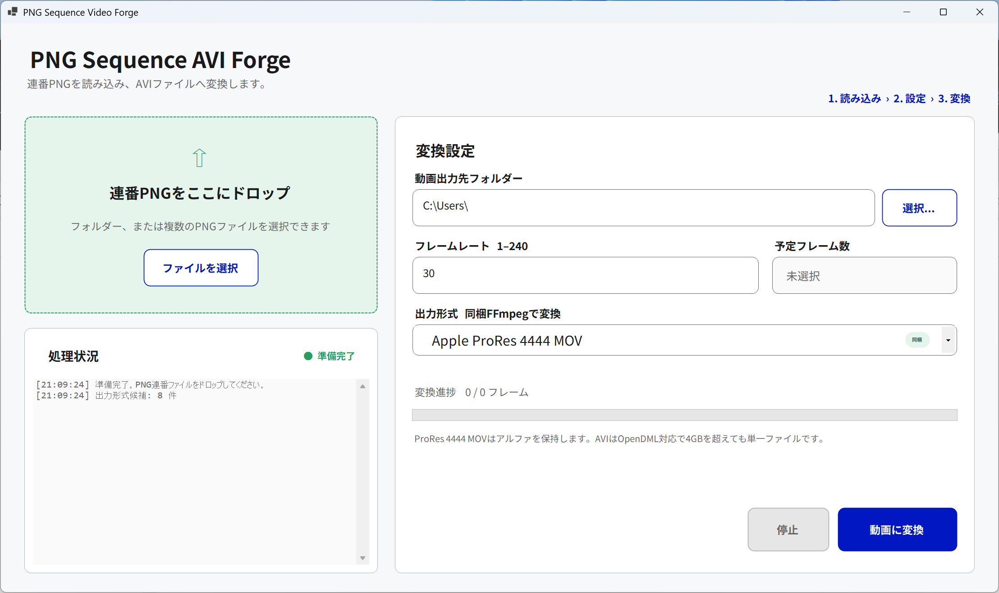

# PNG Sequence Video Forge

連番PNGをWindows上で動画へ変換するデスクトップアプリです。Apple ProRes 4444 MOV、無圧縮OpenDML AVI、UtVideo AVIを出力できます。



## 特徴

- PNGフォルダーまたは複数のPNGファイルを読み込み
- ファイル名末尾の番号を使って連番を自動判定
- ProRes 4444 MOVへのアルファチャンネル保持
- OpenDML AVIによる大容量AVIの出力

## 動作環境

- Windows 11 64bit（x64）
- 配布版：.NET 8 Runtimeの追加インストール不要
- ソースからのビルド：.NET 8 SDK、PowerShell、インターネット接続

## ダウンロード

配布版は[Releases](https://github.com/opopoposiop/PngSequence/releases)からダウンロードしてください。

配布ファイルには、Windows x64向けの自己完結型単一実行ファイルを使用します。ファイル名やSHA-256は各Releaseの説明を確認してください。

## 使い方

1. `PngSequenceAvi.exe`を起動します。
2. 連番PNGまたはPNGが入ったフォルダーをドロップします。
3. 動画出力先フォルダーを選択します。
4. フレームレートを1から240の整数で入力します。
5. 出力形式を選択します。
6. 「動画に変換」をクリックします。

連番ファイル名の例：

```text
frame_0001.png
frame_0002.png
frame_0003.png
```

ファイル名末尾の番号を使って並べ替えます。フォルダーを指定した場合、直下のPNGファイルだけを読み込みます。

## 出力形式

1. Apple ProRes 4444 MOV
2. 無圧縮 AVI (OpenDML)
3. UtVideo RGB AVI (OpenDML)
4. UtVideo RGBA AVI (OpenDML)
5. UtVideo YUV420 BT.601 AVI (OpenDML)
6. UtVideo YUV422 BT.601 AVI (OpenDML)
7. UtVideo YUV420 BT.709 AVI (OpenDML)
8. UtVideo YUV422 BT.709 AVI (OpenDML)

ProRes 4444は`prores_ks`、profile 4、`yuva444p10le`で出力し、RGBA PNGのアルファチャンネルを保持します。

[Ut Video](https://github.com/umezawatakeshi/utvideo)は別途インストールが必要。PNG Sequenceには含まれません。

AVIはFFmpegのOpenDML対応AVI muxerで作成します。従来のRIFF AVIの約4GB境界を超える場合も、自動分割せず単一の`.avi`として出力します。ただし、保存先ファイルシステムの最大ファイルサイズと空き容量の制限を受けます。4GBを超える出力にはNTFSまたはexFATを推奨します。

## 制限事項

- 音声入力・音声出力には対応していません。
- すべての入力画像は同じサイズである必要があります。
- 同名のMOVまたはAVIが存在する場合は上書きします。
- 実行時に外部の`ffmpeg.exe`を探索したり、入力画像を外部へ送信したりしません。
- ProRes、UtVideoおよび動画形式の特許・商標・利用条件は、利用地域と用途に応じて利用者が確認してください。

## FFmpeg

動画変換には、[BtbN FFmpeg Builds](https://github.com/BtbN/FFmpeg-Builds)のLGPLビルドを使用します。FFmpegはビルド時に取得し、アーカイブと実行ファイルのSHA-256を検証したうえで単一EXEへ埋め込みます。

使用したビルド、取得元、ハッシュ、ライセンス情報は[THIRD_PARTY_NOTICES.md](THIRD_PARTY_NOTICES.md)に記載しています。ライセンス本文は[FFMPEG-LICENSE.txt](FFMPEG-LICENSE.txt)を参照してください。

## ビルド

通常のReleaseビルド：

```powershell
powershell -ExecutionPolicy Bypass -File .\src\prepare-ffmpeg.ps1
dotnet build .\src\PngSequenceAvi.csproj -c Release
```

単一実行ファイルの作成：

```powershell
powershell -ExecutionPolicy Bypass -File .\src\build-single-exe.ps1
```

生成物：

```text
src\bin\Release\net8.0-windows\win-x64\publish\PngSequenceAvi.exe
```

`vendor/ffmpeg/ffmpeg.exe`はリポジトリへコミットせず、`src/prepare-ffmpeg.ps1`で取得してください。

## リリース確認項目

- アプリが起動し、8種類の出力形式が表示される
- PNGフォルダーと複数PNGを読み込める
- ProRes 4444 MOVを作成でき、アルファを保持する
- 無圧縮AVIと各UtVideo AVIを作成できる
- 4GBを超えるAVIをOpenDML単一ファイルとして作成できる
- 進捗表示と停止操作が動作する
- 100%、150%、175%のDPIで表示が崩れない

## トラブルシューティング

### PNGが見つからない

- 拡張子が`.png`であることを確認してください。
- ファイル名末尾に数字があることを確認してください。
- フォルダーを指定した場合、PNGがフォルダー直下にあることを確認してください。
- すべての画像サイズが同じであることを確認してください。

### 変換できない

- 出力先の書き込み権限と空き容量を確認してください。
- 同名のMOVまたはAVIを別アプリで開いていないか確認してください。
- 4GBを超える場合、保存先がNTFSまたはexFATであることを確認してください。
- セキュリティソフトが`%LOCALAPPDATA%\PngSequenceAvi\ffmpeg`の実行を遮断していないか確認してください。

## UIデザイン

UI設計の参考として、[デジタル庁デザインシステム](https://design.digital.go.jp/dads/)を参照しています。本アプリはデジタル庁の公式製品・認定製品ではありません。

## 謝辞

- [FFmpeg](https://ffmpeg.org/) — 動画変換
- [BtbN/FFmpeg-Builds](https://github.com/BtbN/FFmpeg-Builds) — Windows向けFFmpegビルド
- [Ut Video](https://github.com/umezawatakeshi/utvideo)  — Windows向けコーデック
- [デジタル庁デザインシステム](https://design.digital.go.jp/dads/) — UI設計の参考

## ライセンス

本プロジェクトのソースコードは[MIT License](LICENSE)で提供します。

FFmpegおよびその他の第三者コンポーネントには、それぞれのライセンスが適用されます。詳細は[THIRD_PARTY_NOTICES.md](THIRD_PARTY_NOTICES.md)を参照してください。
